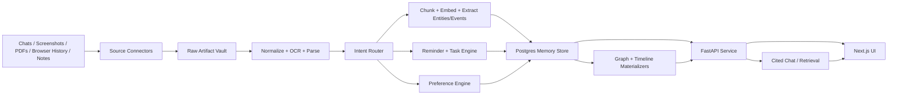

# Architecture Draft v0

## Design Principles

- Local-first by default: personal data stays on the user's machine unless a
  hosted model provider is explicitly configured.
- Evidence before inference: every memory, edge, summary, and answer points back
  to source artifacts.
- One durable source of truth first: keep core data in Postgres before adding
  specialized databases.
- Pluggable models: embeddings, OCR, and LLM extraction should be provider
  interfaces, not hard-coded vendors.
- Incremental ingestion: every stage can be retried without duplicating data.
- Intent before action: natural-language input should be classified before it
  becomes memory, reminder, summary, or preference.

## High-Level Flow



## Runtime Components

### 1. Source Connectors

Connectors turn outside data into internal `Artifact` records.

- `notes_importer`: scans Markdown folders.
- `pdf_importer`: imports PDFs and office docs.
- `screenshot_importer`: watches a directory for images.
- `browser_history_importer`: copies and reads Chromium/Firefox history SQLite
  files in read-only mode.
- `chat_importer`: imports exported conversations from supported formats.

Connectors do not interpret meaning. They only capture source metadata, file
hashes, timestamps, and raw payload pointers.

### 2. Raw Artifact Vault

The vault stores immutable originals under a content-addressed path:

```text
data/artifacts/
  sha256-prefix/
    sha256-full/original.ext
    sha256-full/metadata.json
```

The database stores the canonical metadata. The filesystem stores large binary
objects.

### 3. Normalization Layer

The normalization layer converts artifacts into structured internal documents.

- PDFs/docs/images: Docling first, with OCR enabled when needed.
- Markdown notes: Markdown AST parser with frontmatter and backlinks.
- Browser history: normalized visit records.
- Chats: normalized conversations, messages, attachments, and participants.

Output should preserve source locations such as page number, heading path,
message id, screenshot OCR box, or URL.

### 4. Enrichment Workers

Workers create the searchable memory layer:

- chunk text with stable chunk ids,
- compute embeddings,
- build full-text vectors,
- extract entities,
- extract events and dates,
- link URLs and files,
- create candidate relationships,
- summarize artifacts and clusters.

Each worker writes an `ingestion_run` record and can be retried safely.

### 5. Intent Router

The intent router turns free-form user input and normalized artifacts into
structured work orders.

Initial intent types:

- `capture_memory`: store durable searchable knowledge.
- `summarize`: create a short or structured digest.
- `create_reminder`: create a reminder or follow-up.
- `create_event`: add a timeline event with optional place.
- `link_to_project`: connect input to an existing project/topic/entity.
- `update_preference`: change UI, ranking, capture, or notification defaults.
- `needs_review`: send to capture inbox because confidence is low or the action
  is sensitive.

Intent output should include:

```text
intent_type
confidence
required_confirmation
extracted_fields
source_artifact_id
proposed_actions[]
model_or_rule_version
```

Rules should handle obvious cases first, such as explicit reminder phrases and
dates. LLM classification can handle ambiguous mixed inputs.

### 6. Memory Store

Postgres is the V0 system of record.

Core tables:

- `sources`: configured source folders/accounts/imports.
- `artifacts`: original files, chat exports, screenshots, visits, and notes.
- `artifact_locations`: page/message/heading/OCR bounding box references.
- `chunks`: normalized searchable units with text, metadata, `tsvector`, and
  embedding.
- `entities`: people, projects, topics, URLs, repos, tools, organizations.
- `entity_aliases`: names and dedupe candidates.
- `edges`: typed graph relationships with confidence and provenance.
- `events`: extracted or source-native timeline events.
- `claims`: extracted statements supported by chunks.
- `collections`: user-created memory groupings.
- `intents`: classified user/artifact intents and confidence.
- `summaries`: generated summaries tied to source chunks or artifacts.
- `reminders`: scheduled reminders and follow-ups.
- `preferences`: user display, ranking, capture, and notification preferences.
- `ui_layout_profiles`: saved layout choices and adaptive UI state.
- `ingestion_runs`: connector and worker run state.
- `feedback`: user corrections, saves, rejects, and merges.

Search indexes:

- Postgres GIN indexes for full-text search.
- pgvector HNSW indexes for semantic similarity.
- B-tree indexes on source, date, entity type, and artifact type.

### 7. Reminder and Task Engine

The reminder engine owns scheduled actions. It should be boring and auditable:

- parse and normalize time with timezone,
- store reminder state in Postgres,
- link reminders back to source memories,
- expose due reminders through the API,
- support notification adapters later.

V0 can start with in-app reminders only. OS notifications, email, mobile push,
or calendar sync should be later adapters.

### 8. Preference Engine

Preferences are durable user-controlled records, not hidden prompt state.

Preference categories:

- `ui`: theme, density, default route, graph/timeline/search preference.
- `capture`: source defaults, review thresholds, auto-save rules.
- `ranking`: preferred projects, recency bias, hidden sources.
- `notifications`: reminder style and quiet hours.
- `privacy`: cloud model permission per source and content type.

Preference updates should use confirmation when they affect privacy, capture, or
notifications.

### 9. Graph and Timeline Materializers

V0 can serve graph queries from Postgres `entities`, `edges`, `events`, and
`chunks`.

When graph traversal or graph algorithms become a bottleneck, project the same
nodes and edges into Kuzu. Kuzu is a good later fit because it is embedded,
supports a property graph model and Cypher, and does not require running a
separate server.

### 10. Retrieval Engine

Search should use a clear scoring policy:

```text
score =
  0.40 semantic_similarity +
  0.30 keyword_relevance +
  0.15 graph_proximity +
  0.10 recency_or_time_fit +
  0.05 source_quality_or_user_feedback
```

These weights are V0 defaults. They should be logged per result so ranking can
be debugged.

### 11. API Layer

FastAPI exposes one internal API used by the UI and workers.

Initial endpoints:

```text
POST /ingest/files
POST /ingest/browser-history
POST /capture
POST /intents/confirm
GET  /artifacts/{artifact_id}
GET  /search
GET  /graph
GET  /timeline
GET  /inbox
POST /summaries
GET  /reminders
POST /reminders
PATCH /preferences
POST /chat
POST /feedback
GET  /runs
```

### 12. UI Layer

Next.js dashboard routes:

```text
/capture      universal input box, inbox, and suggested actions
/search       hybrid search results and filters
/graph        interactive memory graph
/timeline     chronological exploration
/artifact/:id source viewer with highlighted citations
/reminders    reminders and follow-ups
/chat         grounded memory chat
/settings     sources, model providers, privacy controls
```

Graph visualization should use React Flow or a lower-level canvas renderer if
large graphs become slow.

Dynamic content components:

- `NoteMemoryCard`: summary, tags, related memories, source text.
- `ReminderCard`: due time, linked source, status, edit controls.
- `PlaceMemoryCard`: place metadata, related events, optional map adapter.
- `DocumentCard`: pages, chunks, extracted topics, citations.
- `PreferenceProposalCard`: suggested UI/capture/ranking change with accept and
  reject actions.

## Privacy and Safety

- Default network mode: no personal data leaves the machine.
- Hosted LLM or embedding providers require explicit configuration.
- Raw artifacts are never overwritten by inference output.
- All generated memories store provenance and model/run metadata.
- User can exclude sources, delete artifacts, or mark content private.
- Browser DBs are copied before reading so live browser files are not mutated.
- Automation lands in the capture inbox unless the source policy explicitly
  allows auto-save.
- Preferences that affect privacy, capture, or notifications require explicit
  confirmation.

## Failure Modes to Design For

- Duplicate artifacts from repeated imports.
- Bad OCR or missing PDF text.
- False entity merges.
- Hallucinated graph edges.
- Ambiguous timestamps.
- Broken source paths after files move.
- Slow search as chunks grow.
- Sensitive data accidentally sent to a hosted model.
- Wrong intent classification creating an unwanted reminder or preference.
- UI personalization becoming confusing or hard to reset.

## Local Development Shape

```text
docker compose up postgres redis
uv run api
uv run worker
pnpm --filter web dev
```

The first implementation should keep the local workflow boring: one database,
one API service, one worker process, one web UI.
